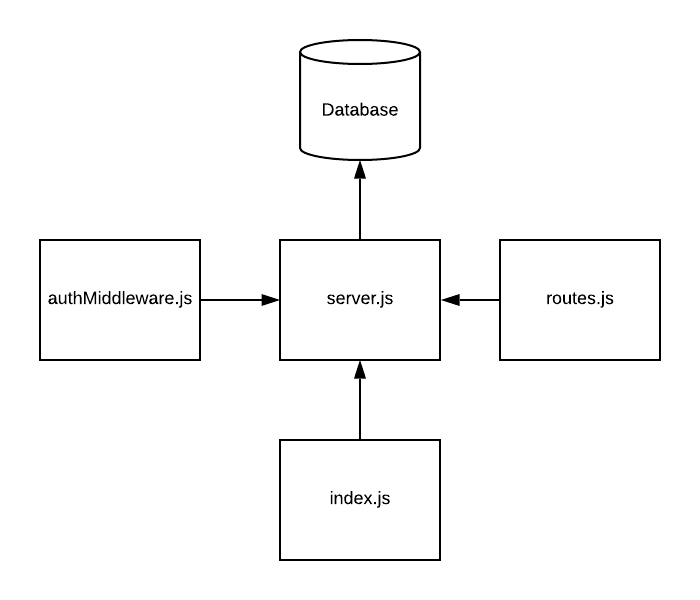

# LAB - 11 

## Authorization

### Author: David Vloeman

### Links and Resources
* [Submission PR](https://github.com/david-vloedman-401-advanced-javascript/401-lab-11/pull/1)
* [Travis](https://www.travis-ci.com/david-vloedman-401-advanced-javascript/401-lab-11)
* [Heroku]() //TODO

#### Documentation
* [API docs](./docs/config/swagger.json) (API servers)

* [JSDocs](./docs/index.html)

### Setup

- clone repo
- npm install

#### `.env` requirements (where applicable)

* `PORT` - Port Number
* `MONGODB_URI` - URL to the running mongo instance/db

#### How to initialize/run your server app (where applicable)

npm start
  
#### Tests

npm test

#### UML

